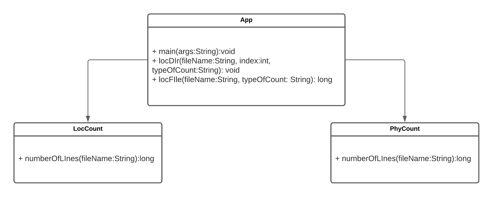
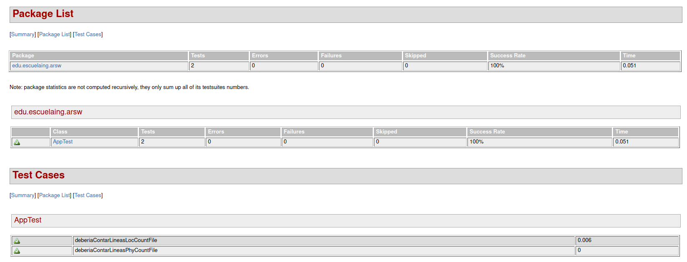

# LOC Counting
**Author: Daniel Alejandro Mejia Rojas**
**Date: 2nd July 2021**

Aplicación que realiza el conteo de líneas de código (LOC) para el cálculo de la métrica LOC/h para medir la eficiencia del desarrollador al desarrollar código. Contiene dos tipos de lectura disponibles: fisicas y sin tener en cuenta comentarios y lineas en blanco.
## Instrucciones de uso
### Prerrequisitos
- git version 2.25.1
- Apache Maven version: 4.0.0
- java version: "11.0.11"

### Ejecucion
Para poder usar el proyecto lo primero que se debe realizar es clonar el proyecto utilizando el siguiente comando desde una terminal:
```
git clone https://github.com/Desarik98/ARSW-LocCount.git
```
Luego debe redirigirse por medio de la terminal al directorio en donde se clono el proyecto la cual contendra el archivo pom.xml.
Una vez ubicado en este directorio se debe compilar el programa, para esto utilice el siguiente comando:
```
mvn package
```
Para finalizar utilice el comando para ejecutar el programa:
```
java -cp LocCount-1.0-SNAPSHOT.jar edu.escuelaing.arsw.App TIPO ARCHIVO
```
Donde TIPO puede ser:
- phy para contar lineas físicas sin excluir comentarios
- loc para contar lineas físicas excluyendo comentarios y lineas en blanco

Un ejemplo de como ejecutarlo
```
java -cp LocCount-1.0-SNAPSHOT.jar edu.escuelaing.arsw.App phy LocCount.java 
```
## Diagrama de clases

## Pruebas
Al ejecutar el comando **mvn package** se compila el programa y ejecuta las pruebas al mismo tiempo. Se prueba la funcionalidad del programa, validando que se cuenten las lineas de codigo de manera correcta con un archivo base. Se podrá encontrar la funcionalidad de estas pruebas en la carpeta TestReport dando click al archivo **surefire-report.html**

## Construccion
* [Maven](https://maven.apache.org/) - Dependency Management
* [Java](https://www.java.com/es/download/)
* [Git](https://github.com/) - Versionamiento
## Autor
* **Daniel Alejandro Mejía Rojas** - LOCS/h 168/12 = 14 LOCS/h - Fecha: 02/06/2021
## Licencia
This project is licensed under the CC0 1.0 Universal Creative Commons License - see the LICENSE.md file for details